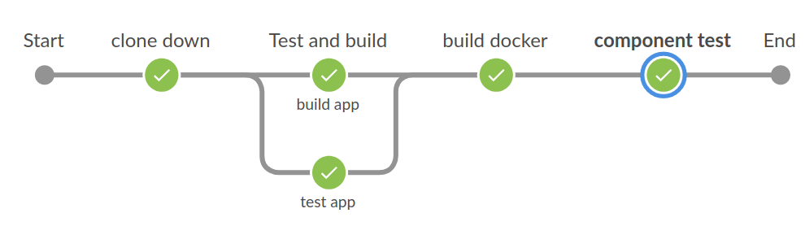

# War of the CI servers

Repo used for the talk "War of the CI servers"

## Different CI's, same pipeline

We have tried to make the same pipeline in all the different CI systems, that should make them look like the image below:

Steps:

* **Clone down:** makes the git clone, and prepares the repo for being distributed to the parallel steps
* **Test:** runs the gradle test command found in [ci/unit-test-app.sh](ci/unit-test-app.sh)
* **Build:** runs the gradle build command found in [ci/build-app.sh](ci/build-app.sh)
* **Build docker:** runs both [building of the docker image](ci/build-docker.sh), and [pushes it up to the hub](ci/push-docker.sh)
* **Component test:** runs a [docker-compose file](component-test/docker-compose.yml) with a [python test](component-test/test_app.py) to test the application.

Link to the pipelines:

* [Jenkinsfile pipeline](Jenkinsfile) written in declarative pipeline
* [GitlabCI](.gitlab-ci.yml)
* [CirleCI](.circleci/config.yml)
* [Github Actions](.github/workflows/gradle.yml)

## feedback and pull request

I would love to have more CI examples doing the same pipeline for comparison. PR are very welcome!